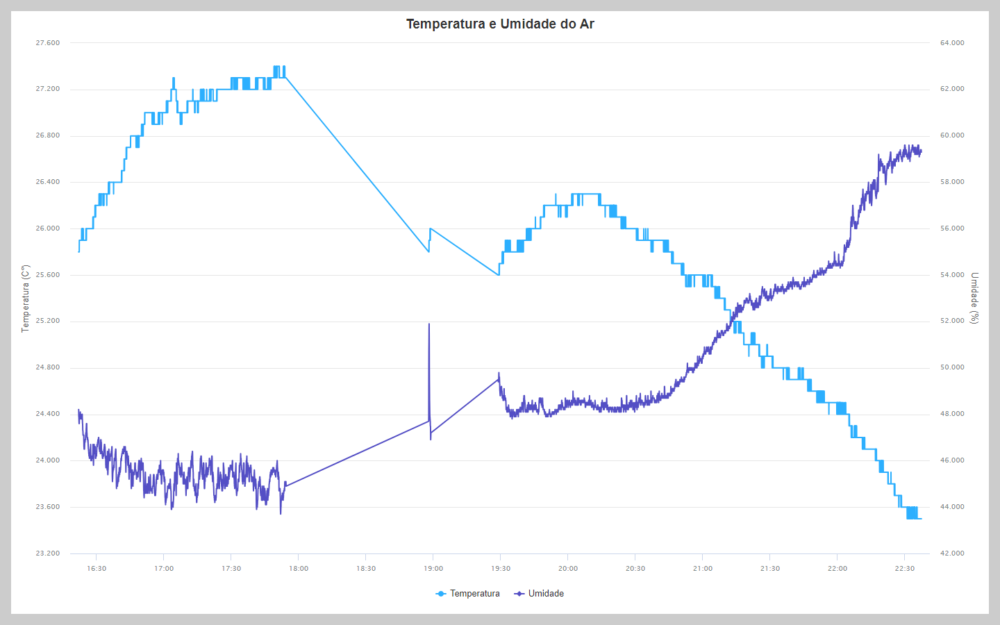

# Gráfico de temperatura e umidade do ar.

## Gráfico de temperatura e umidade do ar gerado a partir de arquivos CSV que foram gerados utilizando Arduino Cloud e coletados por um ESP32 com DTH22.



## Como executar esse projeto.

### Primeiro clone este repositório.

```
git clone https://github.com/Alex5ander/grafico-de-temperatura-e-umidade-do-ar.git
``` 

### Depois execute o projeto em um servidor web de sua preferência.

[Demo](https://alex5ander.github.io/grafico-de-temperatura-e-umidade-do-ar/)  